# Smart Heating Controller Attachment

This repository contains the design, firmware, and web interface for a **Smart Heating Controller Attachment** that enhances an existing heating system with Wi-Fi functionality. With this attachment, you can control your heating remotely, set timers, and enjoy advanced automation without replacing the original controller.

  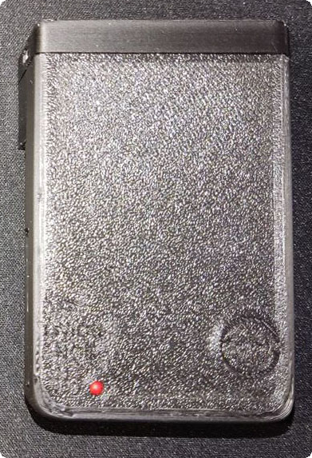
  

---

## Features

### 1. **Wi-Fi Control**

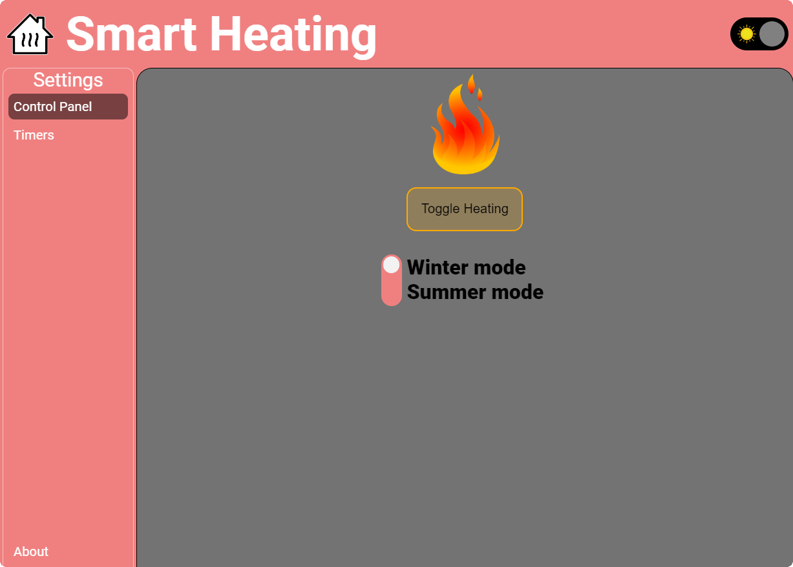

- Turn your heating system **ON** or **OFF** remotely via a web interface.
- Adjust settings conveniently without physical access to the controller.

#### Light and Dark Themes, On/Off State, and Mobile/Desktop View

The web interface is responsive and supports:

- **Light and Dark themes** with a toggle switch.

  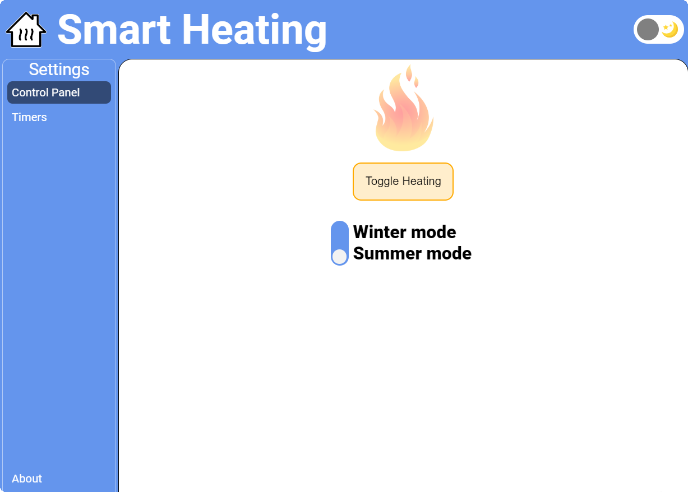
  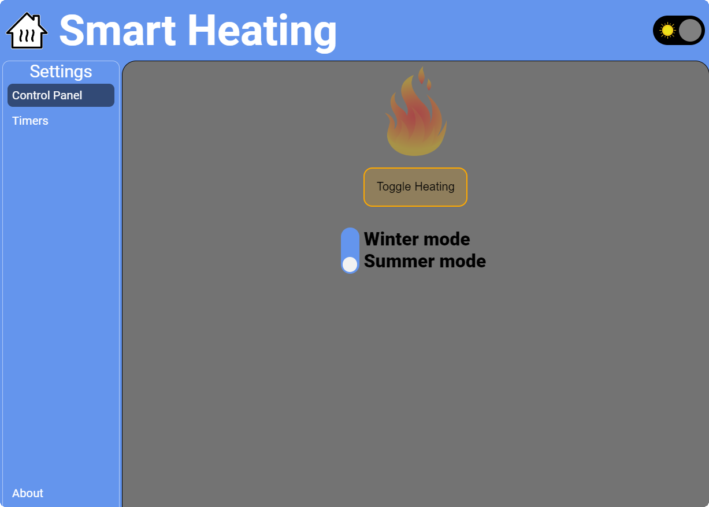

- Visual indication of heating states:
  - **Red**: Heating is ON.
  - **Blue**: Heating is OFF.

  
  

- Optimized views for both **mobile** and **desktop** devices.

  
  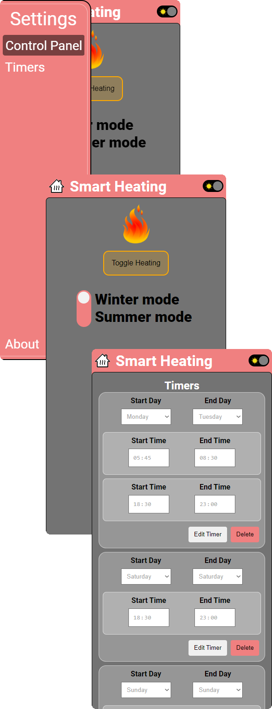

Try a preview of the website here: [Website Preview](https://htmlpreview.github.io/?https://raw.githubusercontent.com/I2oman/Smart_Heating/master/Smart_Heating_Website/controlpanel.html)

---

### 2. **Flexible Timer Configuration**

  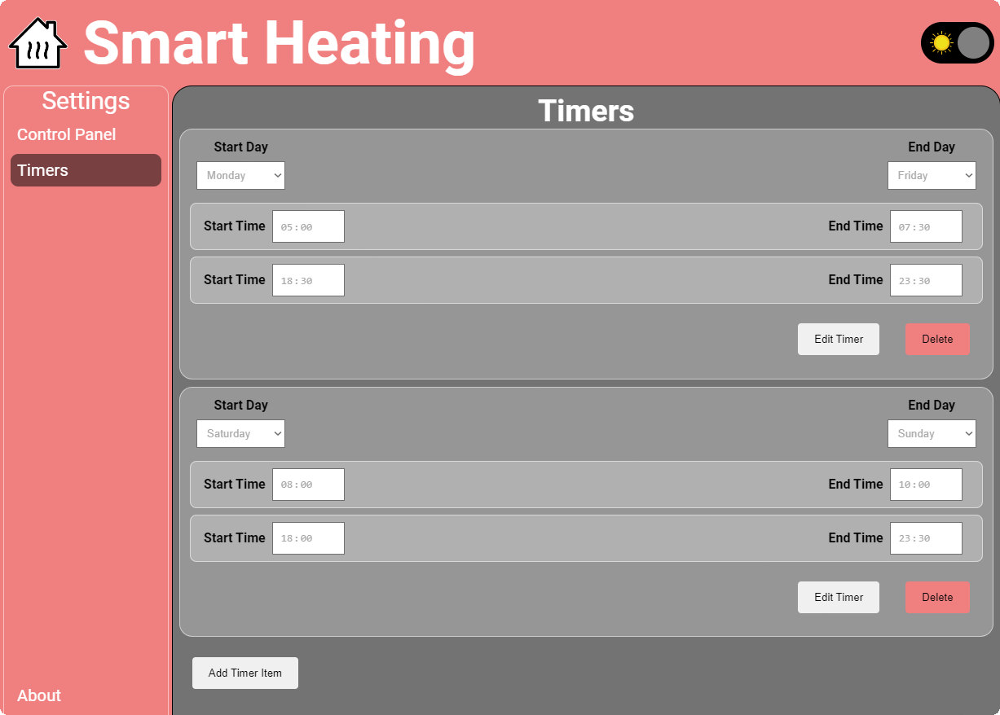
  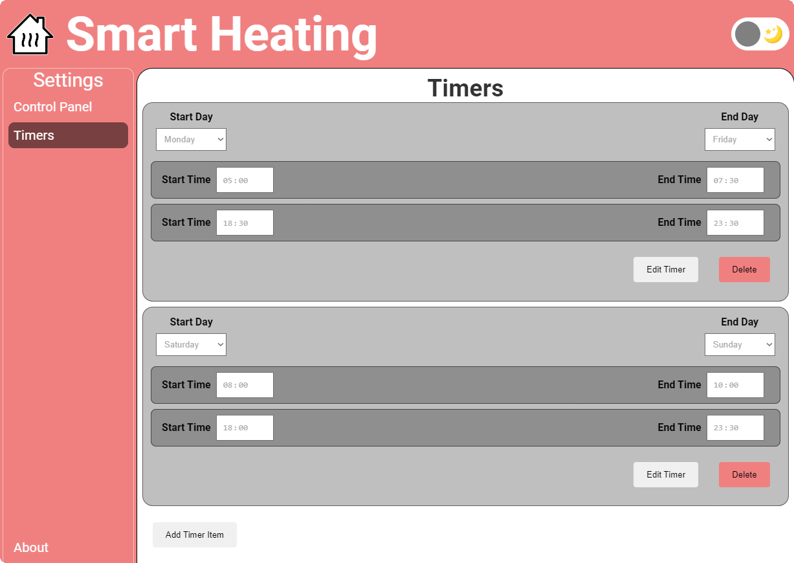

- Set timers for specific days or ranges of days, such as:
  - **Monday only**
  - **Monday to Friday**
  - **Saturday to Sunday**
  - Or any other custom day combinations.
- Configure hour-specific timers within each day or day range:
  - Example: From **8:00 AM to 10:00 AM** and **6:00 PM to 10:00 PM**.
- Timers are stored in the controller’s memory:
  - Settings remain intact even after a restart or power outage.

---

### 3. **Battery Backup**

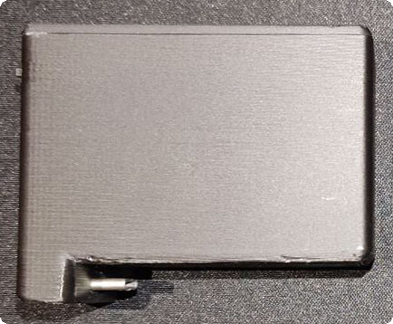

- Includes a **24–26 hour battery backup**:
  - Can be replaced daily with a fully charged one.
  - Supports on-site charging for uninterrupted operation.

---

## Components

1. **Firmware:**

   - Written in Arduino-compatible C++ for reliability and ease of customization.

2. **Hardware:**

   - Designed as an add-on to fit existing heating controllers.
   - Equipped with a robust battery system for power resilience.

3. **Web Interface:**
   - A user-friendly dashboard to manage heating, timers, and automation settings.

---

## How It Works

### Initial Setup

In the `.ino` firmware file, a maintenance mode allows uploading HTML/CSS/JS files for the web interface to the ESP32.

1. Ensure the `#define MAINTENANCE` line is uncommented in the firmware.
2. Upload the firmware through the Arduino IDE.
3. Open the serial terminal and wait for the message: `"Done uploading!!!"`.
4. After successful upload, comment out the `#define MAINTENANCE` line and re-upload the firmware for normal operation.

  

---

### Normal Operation

- **Installation:** Attach the module to your existing heating controller.
- **Setup:** Connect to the Wi-Fi network and access the web interface.
- **Operation:** Configure timers, toggle heating, and let the system handle the rest.

---

## Photos

### Heating Controller with Module Detached

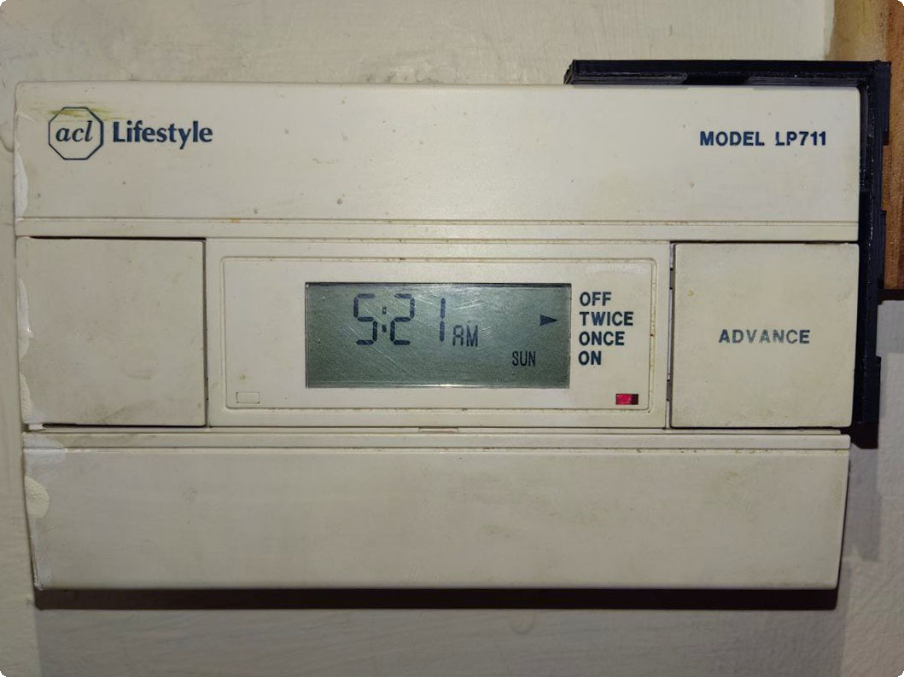

### Module and Battery Photo

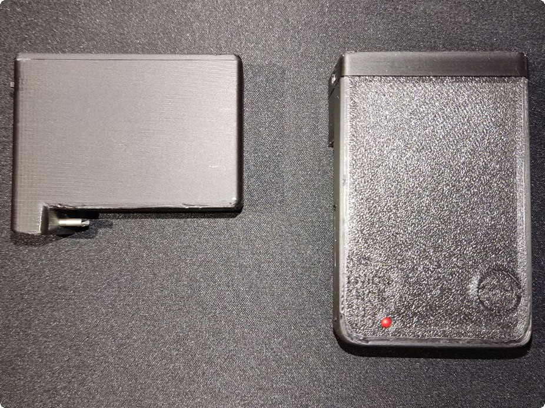

### Module Rear View

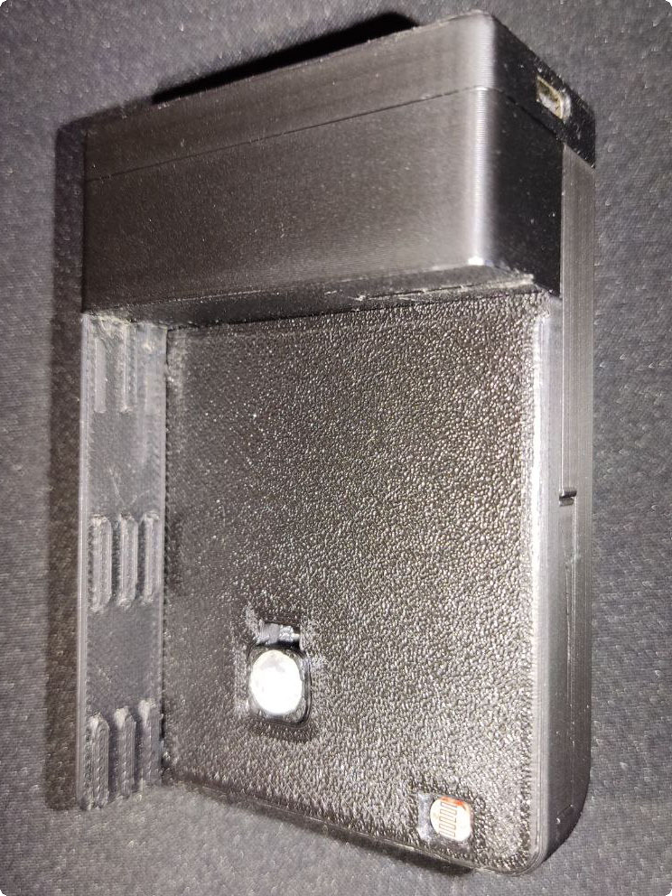

### Website

  
  

  
  

### Heating Controller with Module Attached

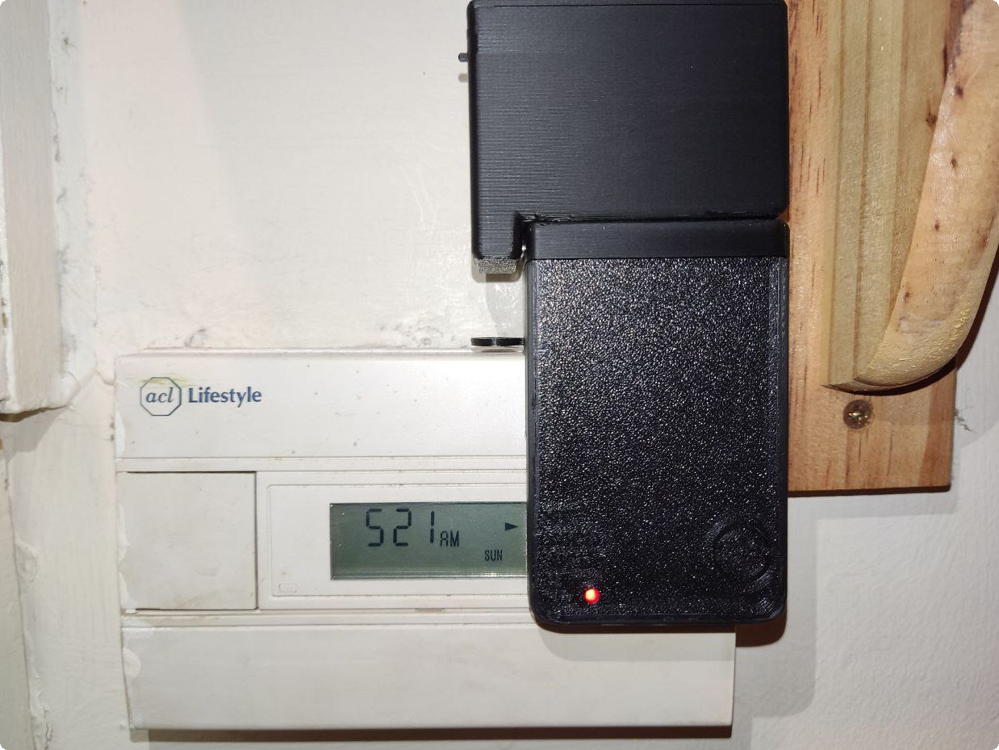
