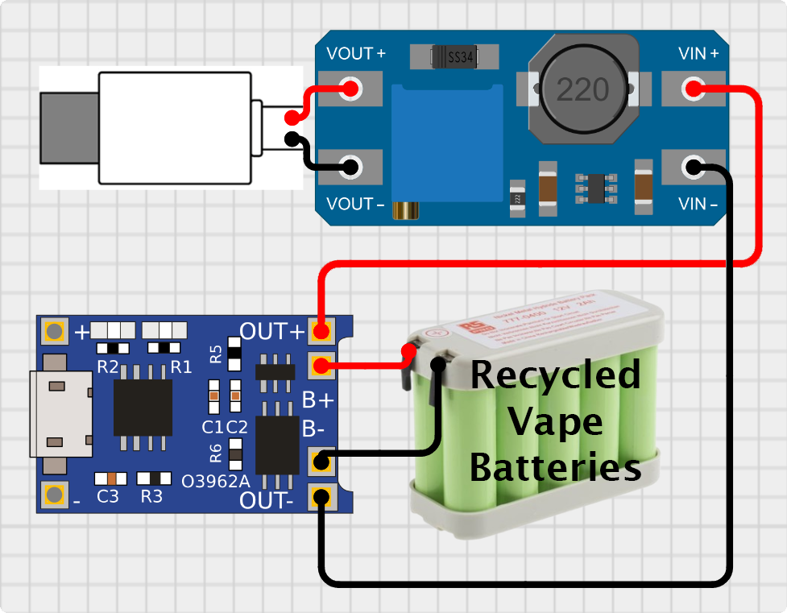

# Smart Heating Controller Attachment

This repository contains the design, firmware, and web interface for a **Smart Heating Controller Attachment** that enhances an existing heating system with Wi-Fi functionality. With this attachment, you can control your heating remotely, set timers, and enjoy advanced automation without replacing the original controller.

  
  

---

## Features

### 1. **Wi-Fi Control**

- Turn your heating system **ON** or **OFF** remotely via a web interface.
- Adjust settings conveniently without physical access to the controller.

#### Light and Dark Themes, On/Off State, and Mobile/Desktop View

The web interface is responsive and supports:

- **Light and Dark themes** with a toggle switch.

  
  

- Visual indication of heating states:
  - **Red**: Heating is ON.
  - **Blue**: Heating is OFF.

  
  

- Optimized views for both **mobile** and **desktop** devices.

  
  

Try a preview of the website here: [Website Preview](https://htmlpreview.github.io/?https://raw.githubusercontent.com/I2oman/Smart_Heating/master/Smart_Heating_Website/controlpanel.html)

---

### 2. **Flexible Timer Configuration**

  
  

- Set timers for specific days or ranges of days, such as:
  - **Monday only**
  - **Monday to Friday**
  - **Saturday to Sunday**
  - Or any other custom day combinations.
- Configure hour-specific timers within each day or day range:
  - Example: From **8:00 AM to 10:00 AM** and **6:00 PM to 10:00 PM**.
- Timers are stored in the controller’s memory:
  - Settings remain intact even after a restart or power outage.

---

### 3. Assembly Guide

#### 1. All the Pieces Needed to Assemble

Below is an image showing all the components and 3D-printed parts required to assemble the Smart Heating Controller (excluding the 1kΩ and 10kΩ resistors). This includes the ESP32 microcontroller, servo motor, touch sensor, LED, resistors, screws, and custom 3D-printed parts.

Carefully ensure you have all the parts before starting assembly. The 3D-printed case and gear mechanism were designed specifically for this project and should fit together seamlessly.

### 2. Electric Circuit and Soldering Manual

The circuit diagram illustrates how all the components are connected to the ESP32 microcontroller. This includes the servo motor, touch sensor, LED, and resistors.

#### Soldering Instructions:

1. Solder a pull-up 10kΩ resistor between the photocell input pin and ground.
2. Solder the 1kΩ resistor to the LED to limit the current.
3. Connect the servo motor to the appropriate GPIO pin as shown in the circuit.
4. Connect the touch sensor to the appropriate GPIO pin as shown in the circuit.
5. Double-check all connections before powering the circuit to avoid any damage to the components.

#### Notes:

- Follow the diagram carefully to ensure correct wiring.
- Use a multimeter to test the continuity of the connections after soldering.
- For safety, keep the circuit powered off during the soldering process.

By following these steps and using the provided diagrams, you can easily assemble and set up your Smart Heating Controller system. For additional guidance or troubleshooting, refer to the project documentation or raise an issue in this repository.

### 4. **Battery Backup**

The battery pack is made by recycling single-use e-cigarettes, giving new life to discarded batteries while promoting sustainability.

To create this battery pack, I used:

- An **MT3608 boost converter** to step up the voltage for the system.
- A **TP4056 charging module** to safely charge the recycled batteries and manage power.

The circuit diagram below illustrates how the components are connected:

Additionally, here's an image of the assembled battery pack created from recycled vape batteries. This pack provides a reliable and sustainable power solution for the Smart Heating Controller:

- Provides a **24–26 hour battery backup**:
  - Can be replaced daily with a fully charged one.
  - Supports on-site charging for uninterrupted operation.

---

## Components

1. **Firmware:**

   - Written in Arduino-compatible C++ for reliability and ease of customization.

2. **Hardware:**

   - Designed as an add-on to fit existing heating controllers.
   - Equipped with a robust battery system for power resilience.

3. **Web Interface:**
   - A user-friendly dashboard to manage heating, timers, and automation settings.

---

## How It Works

### Initial Setup

In the `.ino` firmware file, a maintenance mode allows uploading HTML/CSS/JS files for the web interface to the ESP32.

1. Ensure the `#define MAINTENANCE` line is uncommented in the firmware.
2. Upload the firmware through the Arduino IDE.
3. Open the serial terminal and wait for the message: `"Done uploading!!!"`.
4. After successful upload, comment out the `#define MAINTENANCE` line and re-upload the firmware for normal operation.

  

---

### Normal Operation

- **Installation:** Attach the module to your existing heating controller.
- **Setup:** Connect to the Wi-Fi network and access the web interface.
- **Operation:** Configure timers, toggle heating, and let the system handle the rest.

---

## Photos

### Heating Controller with Module Detached

### Module and Battery Photo

### Module Rear View

### Website

  
  

  
  

### Heating Controller with Module Attached

